# AI Study Buddy: Adaptive Learning Platform

> **Personal Project | EdTech & AI Engineering**
> An intelligent React application that leverages Generative AI (Google Gemini) to transform static PDF lecture notes into interactive, gamified study sessions.

<div align="center">
  <!-- USA LA FOTO: Quella della Dashboard con i due riquadri "Flashcard" e "Quiz" al centro -->
  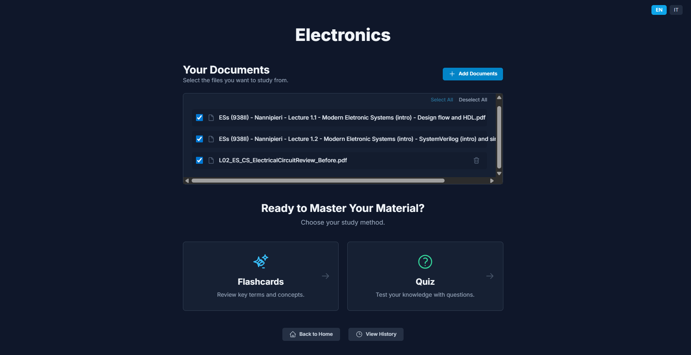
</div>

| Info | Details |
| :--- | :--- |
| **👤 Author** | **Giovanni Del Bianco** |
| **🛠️ Tech Stack** | **React (TypeScript)**, **Vite**, **Tailwind CSS**, **Google Gemini API** |
| **🧠 AI Engineering** | **Context Injection**, **Structured JSON Output**, **Prompt Engineering** |
| **🎯 Goal** | Automate the creation of **Active Recall** materials (Flashcards & Quizzes) directly from university course PDFs to enhance learning efficiency. |
| **🔗 Live Demo** | *[Insert Link if deployed, or remove row]* |

---

## 🧠 Purpose and Motivation

### The Challenge: Passive vs. Active Learning
University students often face a massive volume of unstructured information (hundreds of PDF pages, slides, notes). The traditional study method—re-reading and highlighting—is scientifically proven to be inefficient ("Passive Review").
True learning happens through **Active Recall**: testing yourself and forcing your brain to retrieve information. However, manually creating high-quality quizzes and flashcards from scratch is incredibly time-consuming, often taking more time than the actual studying.

### The Solution: An AI-Powered Tutor
**AI Study Buddy** bridges this gap. It acts as a personal tutor that ingests your specific course material and automatically generates high-quality active recall tools.
Unlike generic chatbots (like ChatGPT) where the interaction is unstructured conversation, this platform:
1.  **Reads** your specific documents locally.
2.  **Structures** the knowledge into discrete learning units (cards/questions).
3.  **Gamifies** the review process with feedback loops.
4.  **Adapts** to your performance, helping you focus on mistakes ("Correction Mode").

This project demonstrates how **Generative AI** can be engineered into a functional product to solve a real-world productivity problem.


## 📱 User Experience & Workflow

The application is designed around a seamless 4-step study loop: **Ingest, Generate, Practice, Refine**.
*Note: While these screenshots capture the Desktop experience, the application is fully responsive and optimized for Tablets and Mobile devices.*

### 1. Ingestion & Parsing (The Setup)
Everything starts with a "Study Buddy"—a dedicated workspace for a specific subject.
*   **Smart Upload:** Users can drag & drop multiple PDF documents (notes, slides, books). The system creates a unified knowledge base from these files.
*   **Privacy-First Architecture:** Text extraction is performed **locally** within the browser using `pdf.js`. Your raw files are processed in memory, optimizing speed and ensuring privacy before the text is sent to the AI.

| Create Buddy | Document Management |
| :---: | :---: |
| 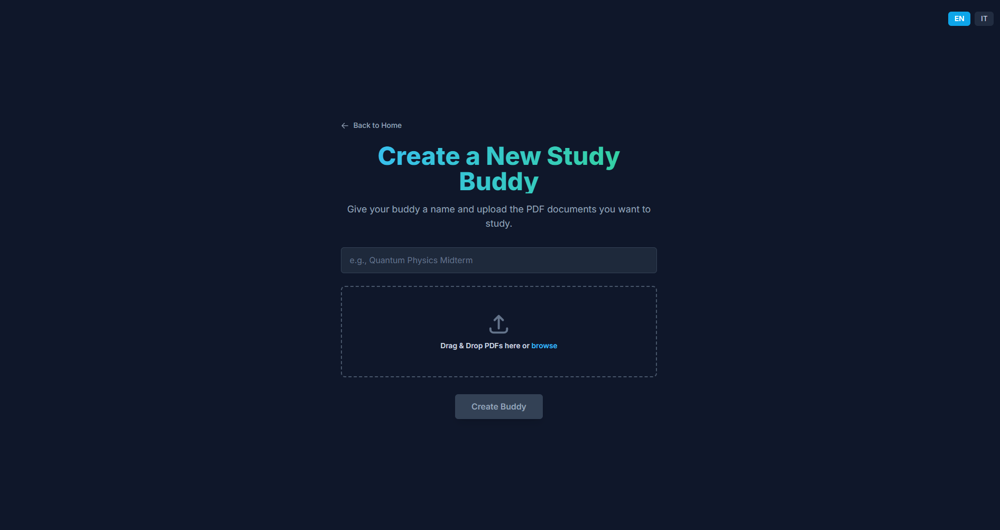 | 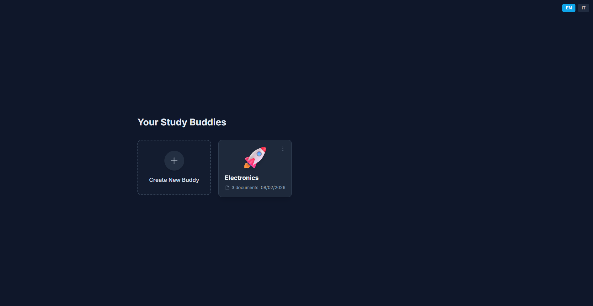 |

### 2. Intelligent Generation (Customization)
Once the context is loaded, the user enters the **Study Dashboard**. Here, the AI takes over but the user remains in control.
Instead of generic questions, the user configures the engine parameters:
*   **Format:** Choose between **Flashcards** (for memorization) or **Quizzes** (for deep understanding).
*   **Intensity:** Select the volume (10, 20, 30 items) and the **Difficulty Level** (Easy/Medium/Hard).
*   **Topic Targeting:** Optionally specify a focus area (e.g., *"Focus only on Quantum Entanglement"*) to narrow down the generation to specific chapters.

| Flashcard Setup | Quiz Setup |
| :---: | :---: |
| 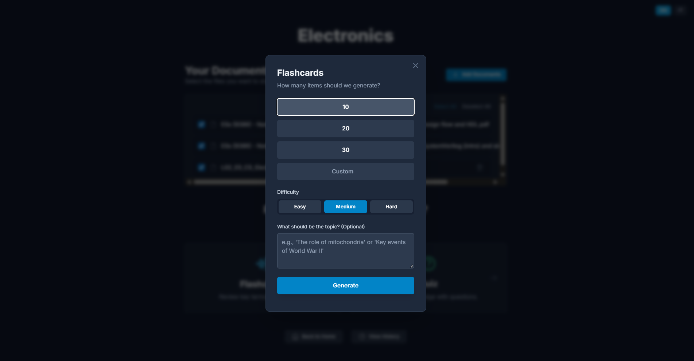 | 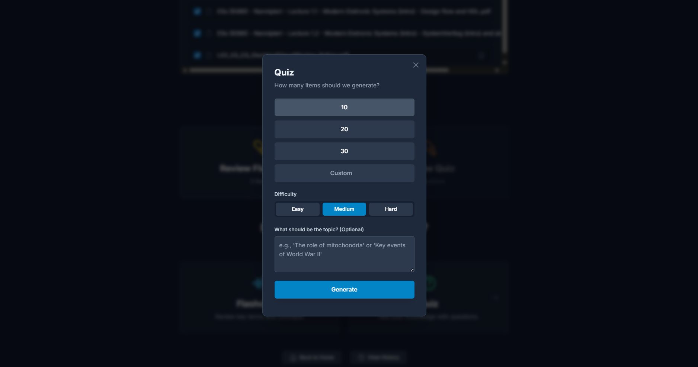 |

### 3. Active Recall Sessions
The generated material is presented in an interactive, gamified UI designed to maximize retention.

#### ⚡ Flashcard Mode
A digital index-card experience focusing on self-assessment.
*   **Progressive Disclosure:** Users see the term, mentally guess the definition, and flip the card to verify.
*   **Smart Hints:** If stuck, users can request an AI-generated hint (*"Show Hint"*) before revealing the answer, promoting active thinking over passive reading.
*   **Spaced Repetition Data:** Users grade themselves ("I Knew It" vs "I Missed It"). This data is captured to determine future review needs.

| Question (Front) | Answer (Back) |
| :---: | :---: |
| 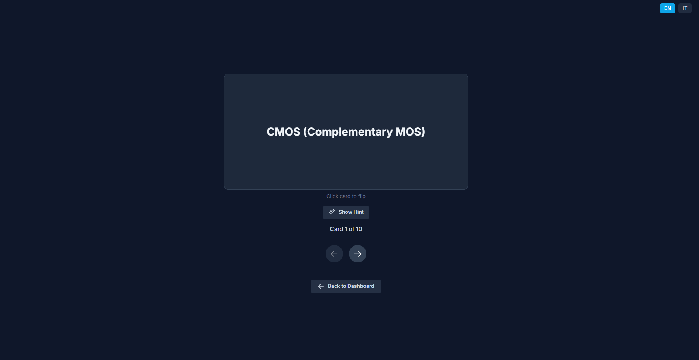 | 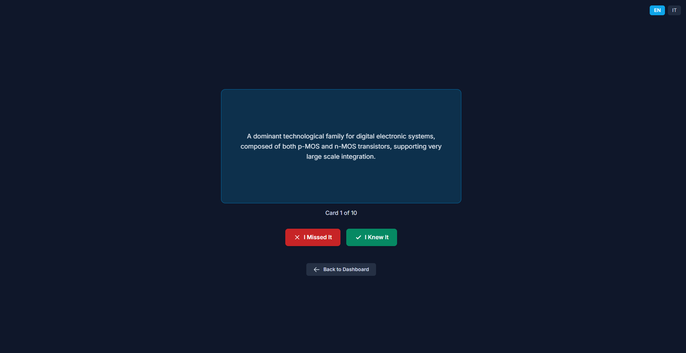 |

#### ❓ Quiz Mode
A multiple-choice examination simulator with immediate feedback.
*   **Instant Validation:** The system validates the answer instantly, reinforcing the correct neural pathway.
*   **Deep Explanations:** Crucially, the AI provides a **"Why?"** explanation. It doesn't just say "Wrong"; it explains *why* the chosen answer is incorrect and *why* the right one is correct, turning every mistake into a micro-lesson.

| Question | Correct Feedback | Incorrect Feedback |
| :---: | :---: | :---: |
| 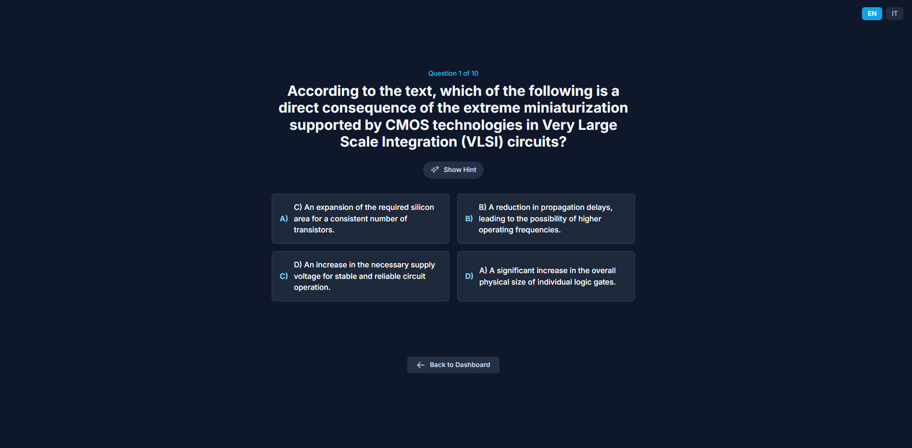 | 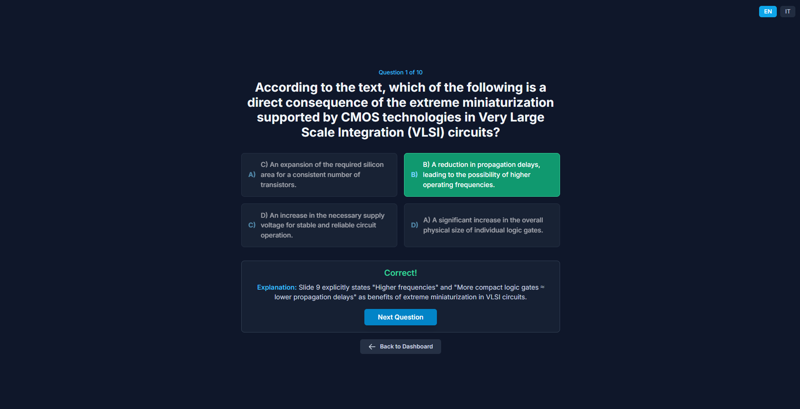 | 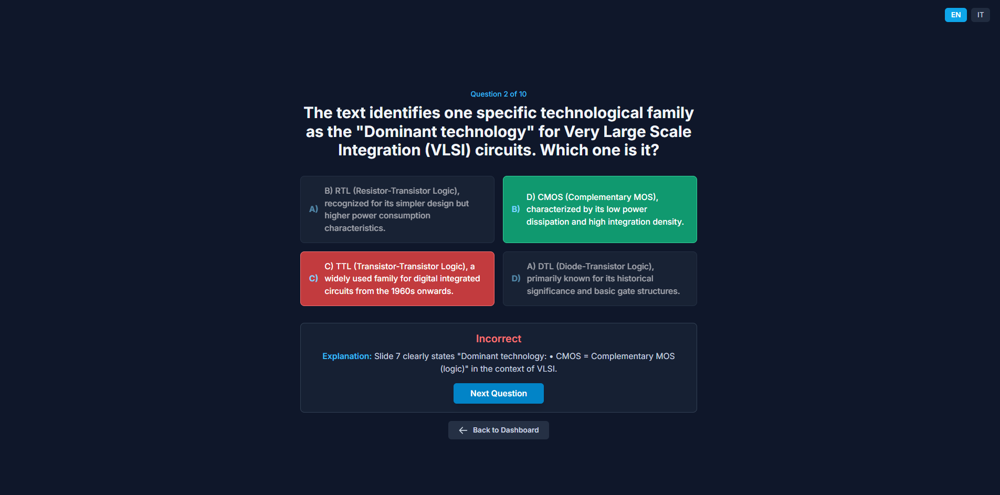 |

### 4. The Adaptive Loop (Correction Mode)
The app tracks performance across sessions. When errors accumulate, the **"Correct Your Errors"** module activates on the dashboard.
This creates a targeted recovery session containing *only* the failed items (both Flashcards and Quiz questions), ensuring the user masters weak points before moving on to new topics.

<div align="center">
  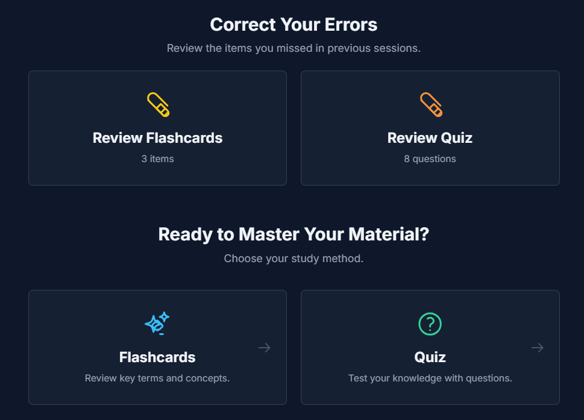
</div>

### 5. Analytics & History
Learning is a continuous process. The **History Section** provides a persistent log of all past activities.
*   **Session Review:** Users can browse past quizzes and flashcards to review concepts without re-taking the test.
*   **Detailed Breakdown:** Clicking on any past item reveals the full context, user answer, correct answer, and the AI's explanation, allowing for effective post-study review.

| History Flashocards | History Quiz |
| :---: | :---: |
| 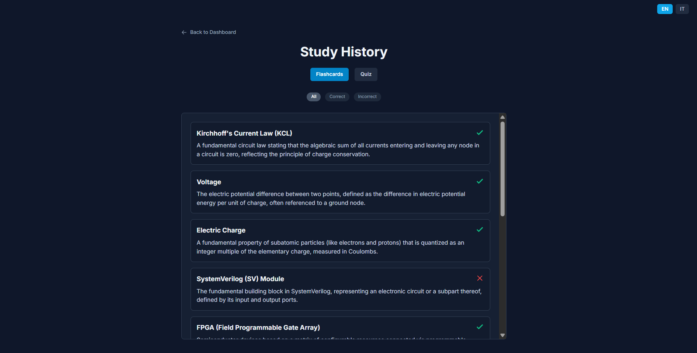 | 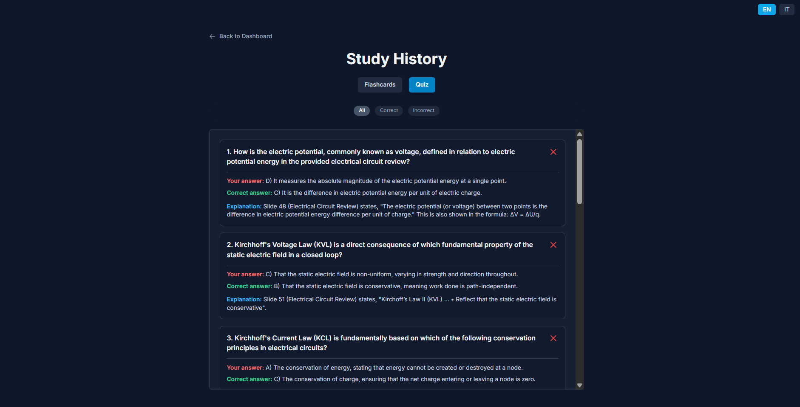 |


## ⚙️ Technical Architecture & AI Engineering

Building a reliable educational tool on top of an LLM requires rigorous engineering to ensure consistency, accuracy, and UI stability.

### 🧠 AI System Design (The "Secret Sauce")
The core challenge in GenAI apps is controlling the output. To prevent unstructured text or hallucinations, the application uses a strict **Prompt Engineering** pipeline:

1.  **Context Injection Strategy:** Text extracted from PDFs is sanitized and injected into the System Prompt. This grounds the model in the specific source material, preventing it from using outside knowledge that might be irrelevant to the specific course.
2.  **Strict JSON Enforcement:** The prompts are engineered to demand a specific JSON Schema.
    *   *Why?* The Frontend expects precise data structures (e.g., `options: string[]`, `correctAnswer: string`).
    *   *How?* The system prompt explicitly defines the JSON structure and forbids any conversational filler (e.g., "Here are your questions..."). This ensures the API response can be directly parsed by the UI without breaking.
3.  **Temperature Optimization:** The model parameters (Temperature ~0.7) are tuned to balance **creativity** (generating diverse distractors for quizzes) with **fidelity** (sticking strictly to the facts in the PDF).

### 🏗️ Frontend Engineering
The application is built as a **Single Page Application (SPA)** with a focus on performance and offline capabilities.

*   **Client-Side Processing:** Unlike many AI wrappers, this app performs PDF text extraction entirely in the browser using `pdf.js`. This reduces server costs to zero and enhances user privacy.
*   **Local Persistence Layer:** To simulate a full-stack experience without a backend database, the app implements a custom persistence layer using the browser's **LocalStorage**.
    *   It serializes complex state (Study Sets, History, Progress) into JSON.
    *   This allows users to close the browser and return to their study sessions exactly where they left off, mimicking a cloud-saved experience.
*   **State Management:** React Hooks (`useState`, `useEffect`, `useMemo`) are orchestrated to manage the complex flow between file uploads, API calls, and the interactive study modes.


## 🛠️ Tech Stack

| Component | Technology | Description |
| :--- | :--- | :--- |
| **Frontend Framework** | **React 18** | Functional components, Hooks, TypeScript. |
| **Styling** | **Tailwind CSS** | Utility-first CSS for rapid, responsive UI development. |
| **Build Tool** | **Vite** | Next-generation frontend tooling for instant server start. |
| **AI Model** | **Google Gemini 1.5 Flash** | Chosen for its large context window (ideal for PDFs) and speed. |
| **PDF Processing** | **PDF.js** | Industry-standard library for rendering and parsing PDFs in JS. |
| **State Persistence** | **LocalStorage API** | Browser-native storage for saving user data without a DB. |

---

## 📂 Project Structure

```text
ai-study-buddy/
├── src/
│   ├── components/
│   │   ├── FileUploadScreen.tsx    # Drag & Drop PDF handler
│   │   ├── StudyDashboardScreen.tsx# Central hub for managing a subject
│   │   ├── FlashcardScreen.tsx     # Interactive flashcard game logic
│   │   ├── QuizScreen.tsx          # MCQ engine with scoring logic
│   │   ├── HistoryScreen.tsx       # Analytics and review interface
│   │   ├── HomeScreen.tsx          # Main landing and buddy selector
│   │   ├── QuantityModal.tsx       # Configuration dialog for new sessions
│   │   └── icons.tsx               # Icon set component
│   ├── services/
│   │   ├── geminiService.ts        # AI API interaction & Prompt Engineering
│   │   └── pdfService.ts           # PDF text extraction logic
│   ├── types/                      # TypeScript definitions (StudySet, Flashcard, Quiz)
│   ├── App.tsx                     # Main Router & Global State Manager
│   └── main.tsx                    # Entry point
├── public/
├── .env.local                      # API Keys configuration (GitIgnored)
├── vite.config.ts                  # Vite configuration
└── package.json                    # Dependencies and scripts
```


## 🚀 Getting Started

Follow these steps to run AI Study Buddy locally on your machine.

### Prerequisites
*   **Node.js** (v18 or higher)
*   A **Google Gemini API Key** (Get it for free from [Google AI Studio](https://aistudiocdn.google.com/))

### Installation

1.  **Clone the repository**
    ```bash
    git clone https://github.com/Giovanni-Del-Bianco/Study_App_AI.git
    cd Study_App_AI
    ```

2.  **Install dependencies**
    ```bash
    npm install
    ```

3.  **Configure Environment**
    Create a `.env.local` file in the root directory and add your API key:
    ```env
    VITE_GEMINI_API_KEY=your_api_key_here
    ```

4.  **Run the application**
    ```bash
    npm run dev
    ```
    The app will launch at `http://localhost:5173`.

---

## 📜 License

This project is released under the **MIT License**.


